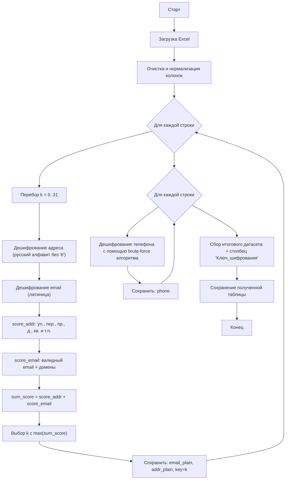

# Задание 3. Деобезличивание данных

## Постановка задачи

Нужно:

1. **Определить алгоритм**, которым обезличены данные в предоставленном файле.
2. **Реализовать программу**, которая деобезличивает набор.
3. В ответе предоставить:
   - объяснение, **как был определён** алгоритм обезличивания;
   - **название алгоритма**;
   - краткое описание реализованного решения;
   - **блок‑схему** алгоритма;
   - **результат работы**: деобезличенный датасет **с добавленным столбцом ключа шифрования**.


## 1) Как определён алгоритм обезличивания

В исходном файле присутствуют 3 смысловых поля:

- `Телефон`
- `email`
- `Адрес`

### 1.1. Поля `email` и `Адрес` — шифр Цезаря

Наблюдения по данным:

- В строках `email` и `Адрес` сохраняются **позиции пробелов, точек, дефисов, цифр**.
- Меняются только **буквы**, причём замена выглядит «равномерной».
- В адресах часто встречаются шаблоны вида `... щс. ...`, `... у. ...`, что похоже на шифрование типичных сокращений `ул.`, `пр.`, `пер.`.

Это соответствует **моноалфавитной подстановке**. Самый простой её частный случай — **шифр Цезаря** (циклический сдвиг алфавита).

Проверка гипотезы:

1. Задаём алфавиты:
   - для адресов — русский алфавит **без «ё»**:  
     `абвгдежзийклмнопрстуфхцчшщъыьэюя` (32 символа)
   - для email — латиница `a..z` (26 символов)

2. Перебираем все сдвиги `k = 0..31` и дешифруем строку (циклический сдвиг «назад»).

3. Выбираем лучший `k` по **эвристическому скорингу**:
   - для адресов: наличие `ул.`, `пер.`, `пр.`, `пл.`, `д.`, `кв.` и т.п.
   - для email: соответствие регулярному выражению email + наличие типичных доменов (`gmail.com`, `hotmail.com`, `.ru`, `.com` и т.д.)

Ключевой вывод:

- **ключ `k` подбирается отдельно для каждой строки**, но внутри одной строки один и тот же `k` подходит и для `Адрес`, и для `email`
  (для email фактически применяется `k mod 26`, но хранится один общий `k`).

Итог: алгоритм обезличивания для `email` и `Адрес`: **шифр Цезаря (циклический сдвиг)** с ключом `k` на запись.

### 1.2. Поле `Телефон` — хэширование SHA‑1

Наблюдения:

- Значения в поле `Телефон` — это строки из **hex‑символов** (`0-9a-f`).
- Длина каждого значения — **40 символов**, что соответствует **160 битам**.

Сопоставление с популярными хэш‑алгоритмами (hex‑длина):

- MD5 → 32 символа (128 бит)
- **SHA‑1 → 40 символов (160 бит)**
- SHA‑256 → 64 символа (256 бит)
- SHA‑512 → 128 символов (512 бит)

Следовательно, формат поля `Телефон` наиболее естественно интерпретируется как **SHA‑1**.
Данные возможно деанонимизировать с помощью атаки "brute-force" (грубая сила), которая занимает довольно болшьое количество ресурсов при переборе всевомозжных значений. Круг поиска сужает домен задачи: мы знаем, что работаем с номерами телефона: а значит, исходные данные - 11 цифр. С помощью hashcat и атаки по маске, возможно восстановить исходные значения.

## 2) Краткое описание реализованного решения

Решение в `main.py` воспроизводит логику из рассуждений `solution.ipynb`.

### Шаги алгоритма

1. Загрузка исходного Excel и приведение к таблице `Телефон / email / Адрес`.
2. Для каждой строки перебираем `k = 0..31`:
   - дешифруем `Адрес` по русскому алфавиту (без «ё»);
   - дешифруем `email` по латинице;
   - считаем `score_addr + score_email`.
3. Выбираем `k` с максимальной суммой score.
4. Формируем деобезличенный датасет:
   - `email` → восстановленный email,
   - `Адрес` → восстановленный адрес,
   - добавляем `Ключ_шифрования = k` (один столбец),
   - `Телефон` расшифровываем с помощью brute-force атаки программы hashcat
5. Сохраняем результат в `.xlsx` (и при необходимости `.csv`).

---

## 3) Блок‑схема алгоритма

P.S. Схема может визуально быть чуть искажена из-за особенностей mermaid



## 4) Как запустить

В папке `task_2`:

```bash
python main.py
```

## 5) Содержание папки

В папке `task_3` находятся:

- `readme.md` — описание задачи, анализ, алгоритм и выводы;
- `solution.ipynb` — полный ход решения (рассуждения, проверки гипотез, наглядные выводы);
- `main.py` — воспроизводимый запуск итогового решения из ноутбука;
- `src/` — вспомогательные модули:
  - `src/caesar.py` — реализация дешифрования шифра Цезаря для русского/латинского алфавитов;
  - `src/scoring.py` — эвристики (скоринг) и подбор ключа по перебору;
- `Деобезличенные данные+ключ_шифрования.xlsx` — итоговый результат (деобезличенные `Телефон`, `email` и `Адрес` + столбец `Ключ_шифрования`);
- `hashes.txt`, `output.txt`, — вспомогательные артефакты


## 6) Результат

Файл результата: **`Деобезличенные данные+ключ_шифрования.xlsx`**

Содержит столбцы:

- `Телефон` — деобезличенный телефон
- `email` — деобезличенный email
- `Адрес` — деобезличенный адрес
- `Ключ_шифрования` — найденный ключ `k` (один столбец на строку)


## 7) Плюсы и минусы применённых способов обезличивания

### 7.1) Шифр Цезаря (циклический сдвиг алфавита) — для `email` и `Адрес`

**Плюсы**
- **Очень быстрый и дешёвый** по вычислениям: работает за O(n) по длине строки.
- **Обратим**: при наличии ключа можно восстановить исходный текст без потерь.
- **Сохраняет структуру строки** (пробелы/цифры/знаки), что удобно для тестов/отладки (виден “скелет” адреса/email).

**Минусы**
- **Криптографически слаб**: перебор ключа тривиален (для русского алфавита 32 варианта).
- **Легко угадывается по шаблонам**: адреса содержат “якоря” (`ул.`, `д.`, `кв.`), email — формат с `@` и доменами, поэтому ключ можно восстановить автоматически.
- **Не обеспечивает реальной защиты ПДн**: это скорее “маскировка”, а не стойкое шифрование.
- **Утечка метаданных**: длина, структура и пунктуация сохраняются → возможны атаки по шаблонам.

### 7.2) SHA‑1 (хэширование) — для `Телефон`

**Плюсы**
- **Необратимость** в типовой постановке: из хэша нельзя “расшифровать” телефон как из шифртекста.
- **Быстро вычисляется**, удобно для сравнения/дедупликации и связывания записей без раскрытия номера.
- **Фиксированная длина** (40 hex) и простой формат хранения.

**Минусы**
- **Уязвим к словарным атакам на малом пространстве**: телефоны имеют ограниченный формат → при наличии словаря/кандидатов возможны совпадения
- **SHA‑1 криптографически устарел** (известны практические атаки на коллизии); для новых систем обычно выбирают SHA‑256/512 или HMAC.
- **Детерминированность без соли**: одинаковые телефоны → одинаковые хэши, возможны linkage‑атаки между наборами.
- Для защиты корректнее использовать **соль**: `SHA*(phone + salt)` снижает риск словарных атак.
